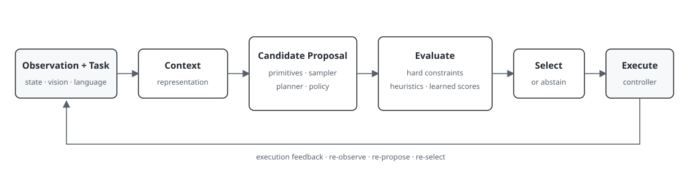

# Architecture

Specification v0.1. This is an experimental runtime design, not an implemented control stack.



The diagram shows the common candidate path. The full design also includes a direct-policy control path and a separate privileged diagnostics process. Neither should be hidden inside the scorer.

## 1. Boundaries

| Component | Input | Output | Must not do |
| --- | --- | --- | --- |
| Environment adapter | Valid controller command | Observation, execution status | Expose future labels to a policy |
| Context builder | Allowed observation, task, past trace | Immutable `Context` | Read privileged evaluator state |
| Proposer | Context, proposal RNG, budget | Candidate specifications | Query a hidden rollout oracle |
| Action compiler | Context, candidate, controller contract | Canonical executable plan | Change semantics after scoring |
| Constraint checker | Context, plan, operational profile | Pass/fail/unknown checks | Treat learned confidence as permission |
| Outcome predictor / WAM adapter | Context, plan or policy context | Predicted outcome/features and/or action proposals | Substitute true future state without marking privilege |
| Scorer | Context, candidate set, optional predictions | Per-candidate evaluations | Execute or mutate a candidate |
| Selector | Evaluations, masks, configured rule | Execute/replan/abort/done request | Force an action from an empty valid set |
| Executor | Chosen plan and observation identity | Bounded-prefix result | Run an expired plan |
| Trace writer | Versioned events and artifact references | Append-only record | Mix labels into policy-visible context |
| Diagnostic evaluator | Hidden snapshot, plans, continuation | Counterfactual labels | Feed labels back into the evaluated policy |

A `DirectPolicy` returns one executable proposal through the same compiler, operational checks, executor, and logger. It bypasses candidate ranking and remains a first-class comparator, not a disguised `K=1` estimate of selection quality.

## 2. Runtime loop

1. Read an observation and construct context with an explicit observation regime.
2. Generate specifications deterministically from the proposal RNG. Compile them against the same anchor observation.
3. Run operational checks. Log rejected candidates and reasons; do not silently replace them.
4. Evaluate admitted plans. Optional model predictions are stored separately from actual branch outcomes.
5. Select the highest configured utility, or emit a bounded replan/abort request. Ties use the canonical opaque candidate ID, not array position.
6. Recheck plan freshness and execute only `execution_steps` controller ticks. The original anchor does not change inside the plan.
7. Record realized motion, execution failures, checks, and both clocks. Observe again and discard the old candidate set.

P1 is already closed loop. P3 adds richer recovery and latency-aware scheduling rather than introducing feedback for the first time.

## 3. Failure handling

The initial runner implements `RUNNING -> REPLAN -> RUNNING` or `ABORTED`; natural environment termination becomes `TERMINATED`, and a step budget becomes `TRUNCATED`. Infrastructure failures have their own `ERROR` state.

An empty admissible pool or entirely nonfinite scores triggers one deterministic reproposal using the documented expanded candidate budget. If it still fails, abort the episode. With synchronous paused simulation, reproposal does not advance physics, but wall time and the reproposal count still accrue. There is no indefinite retry loop or hidden model fallback.

`HOLD` is an ordinary, bounded pose-maintenance candidate that passes the same checks. It is not a universal safe stop. A hardware adapter needs a separately reviewed stop strategy and is out of scope. A policy `DONE` request is logged but cannot set the benchmark success label.

Late remote responses are invalidated by observation identity. P1 does not call remote services. Future online adapters must log request, queue, network, decode, and timeout costs without storing secrets.

## 4. Information separation

Use different runtime and diagnostic objects/processes. The policy context has no environment handle, snapshot path, reward function, future images, counterfactual outcomes, or evaluator-only success flags. Exact object poses are permitted only in the explicitly state-assisted track.

Snapshots, oracle continuations, and branch labels live in a private diagnostic artifact namespace. Read-only offline joins associate labels with candidate IDs after policy evaluation. An oracle baseline is always reported as privileged and cannot be compared as if it has the same information as a learned runtime scorer.

Past observed failures may be used by a policy only if the failure detector is part of its declared observation contract. Simulator truth is not silently promoted to an online recovery signal.

## 5. Candidate support and representation

Three concepts remain independent:

- **Support:** which physical motions are present in the candidate set.
- **Encoding:** how the same motion is described to a scorer.
- **Execution:** how the chosen motion is tracked by the controller.

A trajectory proposer or policy can expand support without changing the scorer. A semantic token or relative-target encoding can change the scorer input without changing support. Experiments must say which axis changes.

A shared scene encoder is optional. P1 numeric context needs no foundation model. P2 first uses a lightweight shared candidate encoder. A learned visual encoder, VLA/WAM candidate generator, or candidate-conditioned world predictor can be added behind existing contracts without becoming mandatory dependencies.

## 6. Simulator and learned world-model roles

A simulator and a learned world/action model are separate experimental objects. A simulator supplies environment dynamics and, when save/restore is validated, privileged counterfactual branch labels. A WAM is a learned model that may (a) propose action chunks, (b) expose world/video latents to a scorer, (c) predict candidate-conditioned outcomes, or (d) be jointly trained with decision supervision.

The core runtime therefore admits two optional branches after proposal:

```text
candidate set
   |-- environment branch (diagnostic only) -> realized counterfactual outcomes
   `-- learned WAM branch (runtime-capable)  -> predicted futures / latents
                                                |
                                                v
                                           evaluator -> selector
```

Never feed diagnostic simulator futures to the online selector. The learned branch may be used online if its inputs satisfy the declared observation regime. Experiments should report both **predictive fidelity** and **decision utility**: a model can have worse pixel/state prediction error yet preserve the ranking information needed to choose a better action.

OpenWAM is the initial WAM integration target because its official stack exposes modular single-, dual-, and tri-system world/action architectures, training/fine-tuning, released checkpoints, and benchmark adapters [R27](references.md#r27). ActionFoundry should integrate through a thin adapter rather than fork its training infrastructure. The first integration reuses a released/fine-tuned checkpoint; decision-head or joint WAM training is a later controlled experiment, not a prerequisite for P0/P1.

## 7. Environment backends

MuJoCo is not the architecture boundary. `EnvironmentAdapter` defines reset/observe/step plus optional snapshot/restore capabilities. Planned backends are:

- NumPy `MockPlanarReach` for exact contract/replay tests;
- robosuite/MuJoCo for Lift/Stack mechanism debugging and branch diagnostics;
- LIBERO for language-conditioned visual transfer;
- RoboTwin 2.0 as the first richer WAM-oriented manipulation target;
- CALVIN as a later long-horizon/relative-action target when a maintained integration is validated;
- ManiSkill or Isaac Lab only when parallel data generation becomes a measured bottleneck.

Backends do not need identical physics engines. Capability discovery must say whether exact snapshot/restore, deterministic replay, rendering, privileged state, and branch rollout are supported. Do not emulate unsupported counterfactual capabilities silently.

## 8. Timing

Default design values are a 20 Hz environment control interface, an eight-tick planned horizon, and four executed ticks per decision. These are experimental settings, not claims of achieved hardware frequency. The simulator's internal integration timestep is separate and is logged.

Paused simulation isolates policy choice. A later latency-aware mode advances the environment while inference runs under a declared hold/continue policy; it must report observation age, missed deadlines, and physical-time success. Never infer closed-loop frequency from requests per second or batched throughput.

## 9. Acceptance boundaries

Before learning: frame and gripper tests, candidate immutability, exact mock replay, bounded retries, privilege isolation, operational-check coverage, and paired simulator trials must pass. Detailed contracts are in [contracts](contracts.md); experiment gates are in [experiments](experiments.md).
